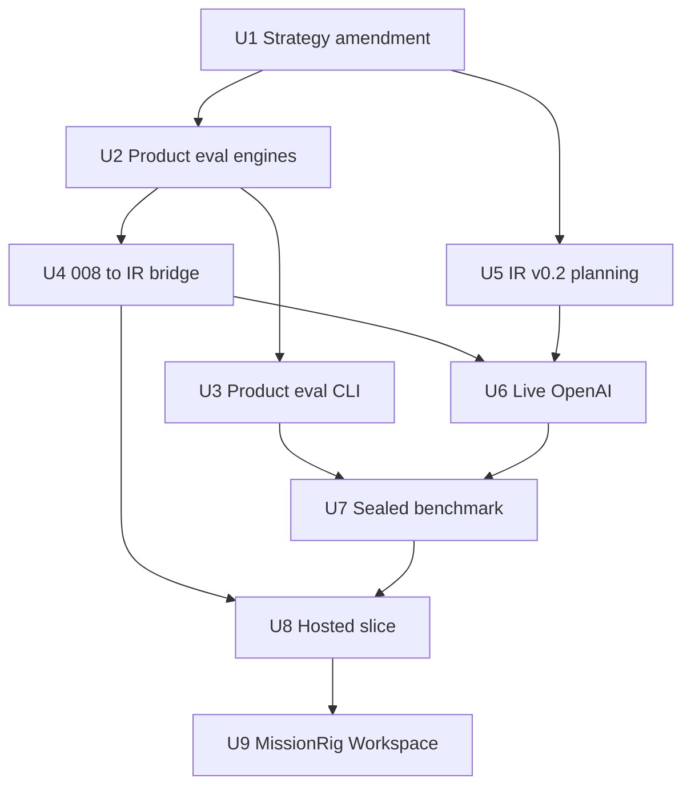
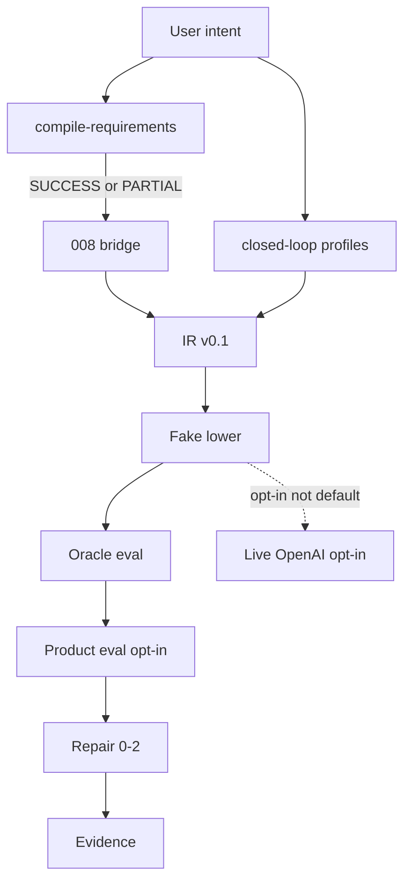

# PromptRig Remaining Product Campaign - Plan

## Goal Capsule

- **Objective:** A person or coding agent can take intent through a headless compile-eval-repair loop, then use Simple Mode and Developer Mode on the same project, with MissionRig able to consume those outputs without changing compiler meaning.
- **Means:** Nine mission-shaped units. Rewrite phase-entry law first so later phases do not wait on independent 4B-exit certification (KTD1).
- **Authority:** Owner session decisions outrank ROADMAP_V1 Phase 4B-exit wording. U1 amends that package. Frozen IR v0.1, existing OAR snapshots, `network_allowed=false` default, and adapter order remain binding.
- **Stop:** Do not edit IR v0.1 schema. Do not add HTTP to the default compile path. Do not treat Vite, JSX, or the conversational skill as Simple or Developer Mode. Do not fill `architecture/mission-026-certification/VERDICT.md`. Do not unlock PRS as a language. Do not add a fifth adapter. Do not label the requirements compiler CERTIFIED. Do not merge or push without owner authority.
- **Execution profile:** Isolated worktree per unit. PromptRig SDD (test-first for engine units). Stop at OAR Ready. Owner Accept is a separate human gate.
- **Tail ownership:** Each unit is its own mission and PR. Do not land Phases 5–9 in one checkout.

---

## Product Contract

### Summary

Finish PromptRig as a product: remaining compiler engineering later phases consume, then IR v0.2 planning, one bounded live path, a sealed benchmark, one hosted Simple+Developer slice, then MissionRig/Workspace. Independent review and CERTIFIED promotion are not gates.

### Problem Frame

The offline fake closed loop already works. The requirements compiler is still PARTIAL. Canonical 008 SUCCESS records cannot enter that loop (`EVR-RQC-0001`). Hosted Simple Mode is hard-forbidden until a headless path exists. ROADMAP_V1 still names independent 4B-exit certification as the door to live, benchmark, and product. That gate would stall the finished product the owner asked for.

### Key Decisions

- Finish the remaining ROADMAP_V1 product through MissionRig/Workspace. (session-settled: user-directed — chosen over 4B-only, headless-usable, next-mission-only, and brainstorm-first: finished product is the destination.) Governs R1, R10, R11, R12, R13.
- Peer review is not a gate. (session-settled: user-directed — chosen over independent 4B-exit certification: peer review is not necessary.) Governs R2, R3.
- Remaining Phase 4B is engineering the product consumes, not a certification campaign. (session-settled: user-approved — chosen over deleting all remaining 4B work: later phases still need eval/repair product scoring and an 008 join.) Governs R4, R5, R6.
- First live *model, credentials, and budgets* stay unpicked until the Phase 6 owner gate. Adapter *order* stays fake → OpenAI → Anthropic → Gemini per OAR-001. Governs R8, R9.
- Hosted stack stays unpicked until the Phase 8 owner gate. Governs R10.

Product Contract preservation: authored in this plan (`ce-plan-bootstrap`).

### Requirements

**Governance**

- R1. The campaign sequences remaining work through a hosted vertical slice and MissionRig/Workspace, not a single implementation PR.
- R2. Independent architecture/security review and CERTIFIED promotion are not prerequisites for later units. U1 must rewrite the docs and honesty tests that currently treat those as gates.
- R3. The fake-adapter eval/repair *oracle* stays CERTIFIED. The requirements compiler stays PARTIAL until a later owner Accept says otherwise. CERTIFIED never expands scope.

**Headless remainder**

- R4. An additive rubric/dataset/baseline/aggregation/regression product-eval path exists beside `evaluate_deterministic`. Closed-loop default stays oracle-only.
- R5. Product eval is callable from both library and `promptrig-compiler` with deep parity before hosted or MissionRig surfaces consume it.
- R6. Canonical 008 SUCCESS (and honest PARTIAL that has representable IR) can enter the existing fake closed loop through a bridge. Raw 008 JSON on `closed-loop` stays `EVR-RQC-0001` until that bridge exists.
- R7. Alias-group implementation stays out unless product eval cannot score multi-source equivalents without coalescing. Identities never merge. PRS language stays deferred.

**IR and live**

- R8. Continuation state and reasoning controls are Phase 5 planning subjects. They do not enter IR v0.1. Live execution in this campaign is single-request.
- R9. One bounded live path may execute OpenAI (first live provider in the frozen adapter order) behind explicit opt-in. Offline compile remains the default and stays byte-stable. Credentials never enter IR, fixtures, logs, or the repository.

**Product and downstream**

- R10. One hosted slice: Simple Mode and Developer Mode operate on the same canonical project the headless compiler already produced. The UI never owns semantics. Vite dashboard and `apps/promptrig.jsx` are not that slice.
- R11. A sealed whole-configuration benchmark uses the product-eval surface as scorer. The oracle remains the rank-1 compile/security/network gate. Historical v0.4 benchmark prose is not a result.
- R12. MissionRig and Workspace consume versioned PromptRig IR and evidence. They must not mutate canonical semantics.
- R13. Headless library and CLI remain the authoritative surface for humans and coding agents. Skills, Custom GPT, and JSX do not gain compile/eval/repair semantics in this campaign.

### Success Criteria

- SC1. An external consumer can run intent → IR → fake lower → eval (oracle, and product eval when opted in) → bounded repair → evidence without a hosted UI.
- SC2. ROADMAP_V1 Phase 5-implementation and Phase 6–9 entry criteria no longer require independent 4B-exit certification. Honesty schedule tests match the new law.
- SC3. Simple Mode and Developer Mode, once built, show the same project/IR/evidence as the CLI for one accepted profile.
- SC4. Live opt-in can fail closed without credentials. Default CI still patches the network and does not call providers.
- SC5. MissionRig or Workspace can consume versioned IR and evidence for one accepted profile without mutating canonical semantics.

### Actors

- A1. Owner (Boss) — Accepts OARs, picks IR v0.2 shape, live model/credentials/budgets, and Phase 8 stack.
- A2. CLI/library consumer — human or coding agent using `promptrig-compiler` and `promptrig.compiler.api`.
- A3. Simple Mode user — later hosted nontechnical author.
- A4. Developer Mode user — later hosted inspector of the same project.

### Key Flows

- F1. Headless closed loop
  - **Trigger:** A2 runs `closed-loop` with an approved profile.
  - **Actors:** A2
  - **Steps:** Intake → IR v0.1 → fake lower → oracle eval → optional product eval → repair budgets `{0,1,2}` → evidence.
  - **Covered by:** R4, R5, R13
- F2. 008 join
  - **Trigger:** A2 has `compile-requirements` SUCCESS (or honest PARTIAL with representable IR).
  - **Actors:** A2
  - **Steps:** Bridge maps accepted 008 mappings onto IR v0.1 → existing compile + F1 eval/repair. Raw 008 JSON on `closed-loop` remains blocked until the bridge exists.
  - **Covered by:** R6
- F3. Bounded live
  - **Trigger:** A1 enables opt-in execution. A2 requests live OpenAI on an already-lowered request.
  - **Actors:** A1, A2
  - **Steps:** Credential check → single-request call → audit → result. Denied credentials fail closed. Offline compile path is unchanged.
  - **Covered by:** R8, R9
- F4. Hosted vertical slice
  - **Trigger:** A3 or A4 opens the product UI after A1 ratifies stack.
  - **Actors:** A1, A3, A4
  - **Steps:** UI calls headless compiler. Same canonical project. Export and deletion exist.
  - **Covered by:** R10, R13
- F5. MissionRig consume
  - **Trigger:** A2 or a downstream generator reads versioned PromptRig outputs.
  - **Actors:** A2
  - **Steps:** Read IR digest + evidence bundle. Render a mission. No write-back into IR.
  - **Covered by:** R12

### Acceptance Examples

- AE1. Covers R6. Given `LAS-POS-SUCCESS-001` on `compile-requirements` is SUCCESS. When A2 runs the 008 bridge then closed-loop on fake. Then evidence contains those requirement identities and is not `EVR-RQC-0001`.
- AE2. Covers R6. Given the same payload is passed to `closed-loop` with no bridge. Then status is BLOCKED `EVR-RQC-0001`.
- AE3. Covers R4. Given `product_eval` is unset. When A2 runs closed-loop. Then only `evaluate_deterministic` runs and oracle PASS/FAIL is unchanged.
- AE4. Covers R9. Given no credentials. When A2 requests live execution. Then the call fails closed and offline goldens are byte-identical to the previous run.
- AE5. Covers R10. Given `profile=simple_mode_ui`. When A2 runs closed-loop. Then Simple Mode remains forbidden. Hosted Simple Mode uses `plain_language_v0`, structured profiles, or the 008 bridge instead.
- AE6. Covers R3, R2. Given U1 has landed. When honesty tests run. Then they still forbid a CERTIFIED requirements-compiler claim and no longer require independent 4B-exit before later phases.

### Scope Boundaries

**In this campaign**

- Strategy-package amendment (docs + honesty tests).
- MISSION-027 product-eval engines, then CLI parity.
- 008 SUCCESS/PARTIAL → IR → fake closed-loop bridge.
- IR v0.2 planning package (SPEC, ADRs, compatibility). No production schema until A1 picks a shape.
- One bounded live OpenAI path.
- Sealed benchmark runner using product eval.
- One hosted Simple+Developer slice after headless remainder exists.
- MissionRig/Workspace consumer boundary.

**Deferred to Follow-Up Work**

- Alias-group engine (OQ-008-004) unless R7 trips.
- IR v0.2 production schema and migration after A1 ratifies a shape.
- Live Anthropic and Gemini execution (order is frozen; they are not the first live path).
- Skill/Custom GPT wrapping of compiler primitives.
- MCP server.
- Fifth provider adapter.
- Dropping `-draft` on the 0.1 requirements contract.

**Outside this product's identity**

- Billing, marketplace, mobile, enterprise control plane.
- UI-owned canonical configuration.
- Unbounded repair or autonomous self-improvement.
- Treating adapter count or green CI as product progress.
- Inherited Supabase as the default platform (REJ-001).
- Cosmetic repo redesign.

### Outstanding Questions

Deferred (non-blocking). Each waits at its phase-entry owner gate.

- Q1. Exact OpenAI model, token/cost ceilings, and credential store for U6.
- Q2. Phase 8 transport and UI stack (FastAPI, Next.js, or owner-selected alternatives).
- Q3. Whether product-eval scoring of multi-source 008 sets trips R7.
- Q4. IR v0.2 field shapes for continuation and reasoning (U5 produces the options; A1 decides).

---

## Planning Contract

### Key Technical Decisions

- KTD1. U1 is a docs-and-honesty-test mission that rewrites ROADMAP_V1 Phase 5-implementation and Phase 6–9 entry criteria, the maturity-map promotion rule, and `test_mission_02*_schedule.py` claims so later units are authorized without independent 4B-exit certification. (session-settled: user-directed — chosen over independent 4B-exit certification: peer review is not a gate; leaving the old law in place would make U5–U9 a governance violation.) Instantiates Key Decision on peer review. Cites R2, R3.
- KTD2. Remaining 4B engineering is U2+U3+U4. Not another 024/026 review pack. Follow `docs/superpowers/plans/2026-08-28-mission-027-eval-repair-product.md` for U2. Deltas: U3 adds CLI parity 027 forbids; U4 is the 008 join 027 also forbids.
- KTD3. 008 join is a *bridge after* `compile_requirements` SUCCESS/PARTIAL. It applies accepted mappings onto IR v0.1, then existing `api.compile` and closed-loop eval/repair. Do not teach `closed-loop` to parse 008 envelopes natively. Keep `EVR-RQC-0001` for unbridged payloads.
- KTD4. Live execution is a new opt-in module, not a flag on `closed_loop.py`. Closed-loop stays fake-only. Adapter order is already OpenAI-first (OAR-001). Conflict call-out: the scoping line “first live provider unpicked” applies to model/credentials/budgets, not to provider order.
- KTD5. Live is single-request. Continuation stays out of IR (artifact/evidence only) until U5 and A1 pick a shape. Multi-turn live cannot work under frozen v0.1.
- KTD6. Agent tools are existing atomic library/CLI primitives plus additive product eval. No workflow MCP. Skills/JSX/Custom GPT stay out of Compiler Core.
- KTD7. Dual CLI stays (ADR-005). `promptrig` is PromptOps. `promptrig-compiler` is Compiler Core. Do not unify them.
- KTD8. Phase 8 is a new UI. Do not extend `apps/dashboard` or `apps/promptrig.jsx`. Stack pick is Q2, not this plan.

### High-Level Technical Design

Campaign sequence. U1 unblocks law. U2–U4 finish the headless loop the product can wrap. U5 may overlap U2–U4 as planning-only. U6–U9 wait on U1 plus the headless remainder they consume.

Canonical runtime after U4. Two intake doors. One IR. One fake loop. Live is a side door.

### Assumptions

None beyond the confirmed synthesis. Inferred bets the owner affirmed: 4B engineering stays; review theater goes; finished product is the destination.

### Implementation Constraints

- Python 3.11+. Runtime deps `jsonschema` and `rfc8785` only until a Phase 6 mission adds an HTTP client behind opt-in extras.
- Do not commit `uv.lock`.
- Isolated worktree. Do not edit the `main` checkout.
- OAR Ready, then owner Accept. Do not rewrite prior Accepted OARs.
- Repair budgets `{0,1,2}`. `EVR-SEC-0001`. `network_allowed=false` on the certified path.
- `simple_mode_ui` / `simple_ui_only` stay forbidden on `closed-loop`.
- Compact `tests/compiler/fixtures/cases.json` is test-only. Not a canonical document.
- Windows: PowerShell. Prefer `uv run --with pytest python -m pytest`.

### Sequencing

U1 first (law). Then U2 (027 as specified). U3 after U2. U4 may parallel U3 after U2. U5 may parallel U2–U4 (planning only). U6 after U1 and U4; needs U5 only if A1 chose a continuation field. U7 after U3. U8 after U4 and U1; needs Q2. U9 after U7 and U8.

---

## Implementation Units

Group by campaign phase. Each unit is one mission. Use PromptRig SDD. Do not implement later units in the same worktree as an earlier one.

### U1. Strategy amendment for skip-cert law

**Goal:** Make Phases 5–9 implementable without independent 4B-exit certification, without claiming the compiler is CERTIFIED.

**Requirements:** R1, R2, R3, AE6. Cites KTD1.

**Dependencies:** None.

**Files:**

- Modify: `architecture/strategy/ROADMAP_V1.md`
- Modify: `architecture/strategy/CAPABILITY_MATURITY_MAP.md`
- Modify: `architecture/strategy/DEFERRED_AND_REJECTED_WORK.md`
- Modify: `architecture/strategy/PROJECT_ORIENTATION.md`
- Modify: `architecture/strategy/PROMPTRIG_PRODUCT_VISION.md` (law 5 and headless-first wording that currently require independent certification before UI/live)
- Modify: `architecture/strategy/REQUIREMENT_TO_ROADMAP_TRACEABILITY.md` and strategy index/decision log as ROADMAP_V1 drift control requires
- Create: `architecture/OWNER_ACCEPTANCE_RECORDS/OAR-022.md` (next free OAR id if 021 is consumed by U2; use the next unused number)
- Modify: `tests/compiler/test_mission_024_schedule.py`, `test_mission_025_schedule.py`, `test_mission_026_schedule.py`, and any sibling that asserts independent 4B-exit as a remaining blocker
- Create: `tests/compiler/test_mission_028_schedule.py` (or this mission's number)
- Create: `architecture/mission-028-certification/README.md` and `MISSION_028_REPORT.md` (adjust number to the actual mission id)

**Approach:**

1. Replace Phase 5-implementation and Phase 6–9 entry “Phase 4B has exited with independent certification” with “U2–U4 engineering complete and owner Accept, no peer-review CERTIFIED promotion.”
2. Keep PARTIAL vs CERTIFIED vocabulary. Oracle stays CERTIFIED. Compiler stays PARTIAL.
3. Rewrite honesty tests so they still fail a CERTIFIED compiler claim and an M3-owned-semantics claim, and so they no longer fail “later phase entered without independent review.”
4. Do not change producers or engines.

**Execution note:** Honesty-test first. A failing schedule test that still requires independent 4B-exit is the first proof.

**Patterns to follow:** MISSION-024/026 honesty inventory (docs + schedule tests only). Do not copy their “review pack” deliverable.

**Test scenarios:**

- Happy path: after the amendment, schedule tests pass while README/maturity map still say requirements compiler PARTIAL.
- Edge: oracle Evaluation/Repair rows remain CERTIFIED.
- Error: a sentence claiming full Phase 4B exit or CERTIFIED compiler still fails the schedule test.
- Integration: `PROJECT_ORIENTATION.md` no longer answers “start Simple Mode now?” with a CERTIFIED-compiler prerequisite; it still says UI must not own semantics.

**Verification:** Strategy files and schedule tests agree. No producer/engine diff. OAR Ready for owner Accept.

---

### U2. Eval/repair product bar

**Goal:** Add rubric/dataset, baseline comparison, scoring aggregation, and a production regression gate beside the oracle.

**Requirements:** R4, AE3. Cites KTD2.

**Dependencies:** U1 may parallel. Prefer U1 first so honesty docs U2 appends do not fight skip-cert law.

**Files:** Bind `docs/superpowers/plans/2026-08-28-mission-027-eval-repair-product.md` and `docs/superpowers/specs/2026-08-28-mission-027-eval-repair-product-design.md`. Deltas vs that plan: JSON fixtures only (no PyYAML); do not flip `architecture/evaluation-repair-contract-v0.1/` to certified; no new CLI (that is U3); do not edit `architecture/mission-026-certification/`.

**Approach:** Execute the existing 027 plan as specified. `evaluate_deterministic` stays unchanged. `ClosedLoopOptions.product_eval` default off.

**Execution note:** Implement new domain behavior test-first per the 027 plan’s task order (dataset → rubric → aggregate → `evaluate_product` → opt-in hook → honesty).

**Patterns to follow:** The 027 plan. Lazy `_LAZY_EXPORTS` in `src/promptrig/compiler/api.py`.

**Test scenarios:** As enumerated in the 027 plan (dataset load, rubric apply, aggregate, regression gate, default-off closed-loop, oracle tests still green). Do not invent a second suite.

**Verification:** 027 plan Definition of Done. Product surface is not CERTIFIED. Compiler stays PARTIAL.

---

### U3. Product-eval CLI parity

**Goal:** A2 can opt into product eval from `promptrig-compiler` with the same result envelope as the library.

**Requirements:** R5, R13. Cites KTD2, KTD6, KTD7.

**Dependencies:** U2.

**Files:**

- Modify: `src/promptrig/compiler/cli_compiler.py`
- Modify: `src/promptrig/compiler/api.py` if a thin CLI wrapper is needed
- Create: `tests/compiler/test_product_eval_cli_parity.py`
- Modify: `tests/compiler/test_library_cli_parity.py` if that is the existing parity home

**Approach:**

1. Add one opt-in flag or subcommand on `promptrig-compiler`. Default remains oracle-only.
2. Deep-compare library `evaluate_product` vs CLI for the 027 fixtures.
3. Do not expose `force_*` test hooks.

**Execution note:** Start with a failing library/CLI parity test on a 027 fixture.

**Patterns to follow:** `tests/compiler/test_library_cli_parity.py`. `test_closed_loop_parity.py`.

**Test scenarios:**

- Happy path: same fixture, library and CLI product-eval JSON match.
- Edge: flag omitted → oracle-only, identical to pre-U3 closed-loop.
- Error: invalid rubric/dataset path → immutable diagnostic, non-zero exit, no network.
- Integration: installed-wheel smoke still runs `promptrig-compiler doctor` without requiring product-eval files.

**Verification:** Parity tests green. Default closed-loop bytes unchanged.

---

### U4. 008 SUCCESS to closed-loop bridge

**Goal:** Canonical 008 SUCCESS (and honest PARTIAL with representable IR) can produce IR, fake artifacts, eval, repair, and evidence.

**Requirements:** R6, AE1, AE2, AE5. Cites KTD3.

**Dependencies:** U2 recommended so product eval can score bridged REQ ids. Oracle-only join may land before U2 if sequencing needs it.

**Files:**

- Create: `src/promptrig/compiler/requirements_ir_bridge.py` (name may adjust)
- Modify: `src/promptrig/compiler/closed_loop.py` (dispatch to bridge; keep unbridged `EVR-RQC-0001`)
- Modify: `src/promptrig/compiler/cli_compiler.py` / `api.py` as needed for an explicit bridge entry
- Create: `tests/compiler/test_requirements_ir_bridge.py`
- Create: `tests/compiler/test_mission_NNN_schedule.py`
- Use existing SUCCESS fixture `LAS-POS-SUCCESS-001` (or the current equivalent in `tests/compiler/fixtures/`)

**Approach:**

1. After `compile_requirements` SUCCESS/PARTIAL, apply accepted RFC 6901 mappings onto IR v0.1.
2. Unresolved required meaning stays BLOCKED. Optional unresolved stays PARTIAL with evidence (OQ-008-002 already in engine).
3. Then existing `api.compile(..., adapter_id="fake")` and closed-loop eval/repair.
4. `simple_mode_ui` stays forbidden.

**Execution note:** Start with a failing test: current SUCCESS payload on closed-loop is `EVR-RQC-0001`; after bridge, same ids appear in IR and evidence.

**Patterns to follow:** `evaluate_contract_rules` as sole RC-065. `requirements_to_ir` for profile intake. Do not fork a second IR compiler.

**Test scenarios:**

- Happy path: AE1. SUCCESS fixture bridges; evidence lists those REQ ids; fake compile runs.
- Edge: honest PARTIAL with optional gaps still emits evidence and does not claim SUCCESS.
- Error: AE2. Unbridged 008 JSON on `closed-loop` remains `EVR-RQC-0001`.
- Error: BLOCKED/REFUSED 008 output does not lower.
- Integration: AE5. `simple_mode_ui` still forbidden. `network_allowed=true` still `EVR-NET-0001`. Repair budget 0/1/2 and `EVR-SEC-0001` unchanged.

**Verification:** One SUCCESS path through F2+F1. Unbridged path unchanged. Schedule honesty still forbids M3 UI semantics.

---

### U5. IR v0.2 planning package

**Goal:** A ratified planning package for continuation and reasoning. No production schema in this unit.

**Requirements:** R8, Q4. Cites KTD5.

**Dependencies:** U1. May parallel U2–U4.

**Files:**

- Create: IR v0.2 SPEC and semantic delta under `architecture/` (exact folder per existing Phase 5 convention when written)
- Modify: `architecture/adr/ADR-007-Multi-Turn-State-IR-Gap.md` only as a Proposed update, not Accepted
- Create: compatibility/migration draft, threat model for opaque provider state, generated-TypeScript impact note
- Create: fixtures that show v0.1 inputs retain defined behavior
- Create: mission certification README and OAR Ready
- Test: schedule/honesty tests that this unit did **not** edit frozen `architecture/compiler-contract-freeze-v0.5/PROMPTRIG_IR_V0_1.schema.json`

**Approach:** Options on the page: evidence-only continuation vs a provider-neutral IR field vs prohibit canonical storage. Recommend evidence-only for the U6 live path. Reasoning stays unsupported in v0.1 (ADR-006 gap). A1 decides Q4 before any later schema mission.

**Execution note:** This unit is contract-first documentation and fixtures. No schema/code change to frozen v0.1.

**Patterns to follow:** MISSION-008 contract-first (SPEC before syntax). REJ-004.

**Test scenarios:**

- Happy path: v0.1 schema file hash/bytes unchanged.
- Edge: unknown-version / downgrade cases described in fixtures with expected fail-closed outcomes.
- Error: a proposed field without a provider-neutral owner fails the package’s own validator.
- Integration: TypeScript generator still matches v0.1 only.

**Verification:** Owner can Accept or reject each IR change. No v0.1 schema diff.

---

### U6. Bounded live OpenAI execution

**Goal:** One opt-in live OpenAI path that cannot contaminate offline lowering.

**Requirements:** R9, R8, AE4. Cites KTD4, KTD5. Q1 is an owner gate inside this unit, not a planner guess.

**Dependencies:** U1, U4. U5 if A1 chose a continuation field; otherwise single-request with continuation out of IR.

**Files:**

- Create: execution request/result contract under `architecture/`
- Create: `src/promptrig/compiler/execution.py` (name may adjust)
- Modify: `src/promptrig/compiler/api.py` and CLI for an opt-in command that is not `closed-loop`
- Create: `tests/compiler/test_live_execution_fail_closed.py`
- Modify: `tests/compiler/test_no_network_and_determinism.py` to keep default path patched
- Create: opt-in live test module that ordinary CI does not collect (marker or extra)
- Threat model + credential redaction rules in the mission certification pack

**Approach:**

1. Adapters remain offline lowerers. Execution is a separate permission boundary.
2. Default extra/env off. No `httpx` on the default install if it can stay an extra.
3. Fail closed on missing/denied/expired credentials. AE4.
4. Retries do not duplicate consequential calls. Cancellation preserves evidence.
5. Live tests never required for ordinary CI.

**Execution note:** Characterization of offline goldens first. Then fail-closed live tests. Then opt-in live tests isolated from default CI.

**Patterns to follow:** `PROVIDER_ADAPTER_CONTRACT.md` (adapters must not execute). `forbid_network` in `tests/compiler/test_no_network_and_determinism.py`.

**Test scenarios:**

- Happy path: opt-in with a test double returns an audit event and a result envelope. Offline compile of the same IR is unchanged.
- Edge: AE4. No credentials → fail closed.
- Error: default closed-loop with network still `EVR-NET-0001`. Socket patch still catches accidental HTTP on default path.
- Integration: `promptrig-compiler compile --adapter openai` still lowers only. It does not call OpenAI.

**Verification:** Offline goldens byte-stable. Live is opt-in. Secrets scan clean. Owner picks Q1 before real-network tests.

---

### U7. Sealed whole-configuration benchmark

**Goal:** An executable sealed runner that scores complete configurations under comparable conditions.

**Requirements:** R11. Cites KTD2.

**Dependencies:** U3 (product-eval CLI). U6 if a live track is in the freeze; otherwise offline-only track first.

**Files:**

- Create: benchmark manifest contract (version, environment digest, source hashes, secrets policy, budgets, repetition)
- Create: runner module and evidence sealer
- Create: `tests/compiler/test_benchmark_manifest_validation.py`
- Historical v0.4 docs under `review-cycles/v0.4/` stay historical. Do not treat them as results.

**Approach:** Freeze oracle as rank-1 safety/compile gate. Freeze U2 product eval as the published scorer. At least three autonomous attempts unless A1 ratifies a smaller budget. Hidden tests inaccessible. No marketing claims without independent dry-run reproduction.

**Execution note:** Manifest validation tests before runner implementation.

**Patterns to follow:** ROADMAP_V1 Phase 7 normative deliverables. REJ-005.

**Test scenarios:**

- Happy path: two identical configs, same sealed env, scores match.
- Edge: infrastructure failure classified separately from product FAIL.
- Error: mutated source hash fails manifest validation.
- Integration: oracle FAIL (security) cannot be published as a product-eval PASS.

**Verification:** Dry run reproduces scores from sealed evidence. No claim in README that a v0.4 document is a benchmark result.

---

### U8. Hosted Simple and Developer Mode slice

**Goal:** One narrow hosted slice where A3 and A4 share one canonical project produced by the headless compiler.

**Requirements:** R10, R13, AE5. Cites KTD8. Q2 is an owner gate at unit start.

**Dependencies:** U1, U4. U3 if the slice shows product-eval scores.

**Files:** New service and UI trees after Q2 (not `apps/dashboard`, not `apps/promptrig.jsx`). OpenAPI or equivalent generated from the headless API. Auth/tenancy/persistence/retention/deletion contracts before code. Accessibility and export/deletion tests.

**Approach:**

1. Ratify Q2 in-mission before scaffolding.
2. UI calls library/CLI semantics. No hidden UI configuration.
3. Simple Mode intake is `plain_language_v0`, structured profiles, or the U4 bridge. Not `simple_mode_ui`.
4. Developer Mode is a reversible view of the same project.
5. Mode-parity tests: CLI vs API vs Simple vs Developer on one fixture.

**Execution note:** Contract and threat model before framework scaffolding. Smoke the headless compiler through the transport before UI chrome.

**Patterns to follow:** Vision law 6 (UI wraps the compiler). DFR-002. REJ-007.

**Test scenarios:**

- Happy path: AE5-compatible intake compiles. Simple and Developer show the same IR digest and evidence as CLI.
- Edge: empty project, PARTIAL compile, unresolved defects visible in both modes.
- Error: cross-tenant read fails closed (once tenancy exists).
- Integration: export then delete; CLI cannot see the deleted project; secrets never in canonical artifacts.

**Verification:** One complete slice independently reviewable by A1. Vite/JSX unused.

---

### U9. MissionRig and Workspace consumer boundary

**Goal:** Downstream mission generation and one workspace integration consume versioned PromptRig outputs.

**Requirements:** R12. Cites KTD6.

**Dependencies:** U7, U8.

**Files:** Mission schema, renderer, mission-report contract, workspace consumer contract. Minimal generator for one accepted specification profile. Conformance and failure-isolation tests. ADR-002 / ADR-003 remain the ownership split.

**Approach:** Generated missions preserve objectives, permissions, stop conditions, and evidence requirements. Downstream failure cannot corrupt PromptRig projects. Agent-specific rendering is deterministic and traced. Do not couple IR to one coding-agent host.

**Execution note:** Contract-first. One profile only.

**Patterns to follow:** `architecture/adr/ADR-003-MissionRig.md`, `architecture/adr/ADR-002-AI-Engineering-Workspace.md`.

**Test scenarios:**

- Happy path: one accepted PromptRig evidence bundle yields a mission that preserves stop conditions and REQ ids.
- Edge: PARTIAL evidence yields a mission that records unresolved defects rather than inventing SUCCESS.
- Error: workspace write-back into IR is rejected.
- Integration: MissionRig crash leaves PromptRig artifacts unchanged.

**Verification:** Downstream products operate through versioned contracts. PromptRig remains semantic owner.

---

## Verification Contract

| Gate | When | Command / proof |
|---|---|---|
| Honesty / schedule | Every unit that touches strategy or claims | `uv run --with pytest python -m pytest tests/compiler/test_mission_*_schedule.py` |
| Compiler unit tests | Engine units U2–U4, U6 | `uv run --with pytest python -m pytest tests/compiler` focused on the unit’s new files |
| Oracle regression | U2, U4, U6 | `tests/compiler/test_evaluation_engine.py`, `test_repair_engine.py`, `test_mission_012_certification.py` stay green |
| No-network default | U2–U9 | `tests/compiler/test_no_network_and_determinism.py` |
| Library/CLI parity | U3, later consumers | `tests/compiler/test_library_cli_parity.py` plus U3 parity file |
| CI | Each PR | Existing eight jobs: OS/Python matrix, TypeScript drift, wheel-install. Do not add live-network jobs to default CI |
| Live opt-in | U6 only | Isolated marked tests. Never required for merge of offline units |
| Wheel / consumer | U2+ | `tests/compiler/fixtures/external_consumer_closed_loop.py` via wheel-install job |

Do not treat green CI as CERTIFIED. Do not commit `uv.lock`.

---

## Definition of Done

**Global**

- Each unit has an OAR Ready and owner Accept before the next unit that depends on that Accept.
- Abandoned spikes are removed from the unit’s branch before merge.
- Honesty vocabulary remains: oracle CERTIFIED, compiler PARTIAL, no M3-owned semantics, no live on the default path until U6 opt-in.
- Frozen IR v0.1 schema unchanged unless a *later* mission after U5+Q4 is separately authorized.

**Per unit**

- U1: AE6. Later phases authorized without peer-review CERTIFIED. Compiler still PARTIAL in tests.
- U2: 027 plan done. Product eval default off.
- U3: Library/CLI product-eval match. Default oracle-only.
- U4: AE1 and AE2. Bridge exists. Unbridged path blocked.
- U5: Planning package exists. No v0.1 schema diff.
- U6: AE4. Offline goldens stable. Live opt-in fail-closed.
- U7: Sealed runner + manifest validation. No false benchmark claims.
- U8: Mode parity on one project. Vite/JSX not used.
- U9: Read-only consume. IR unmutated.

---

## System-Wide Impact

- **Agent parity:** Library/CLI first (KTD6). Hosted UI is a later wrapper. Skill/GPT/JSX must not become the compiler.
- **Security:** U6 introduces the first HTTP client. Default path must stay offline. Secrets never in canonical artifacts.
- **CI:** Live tests stay opt-in. Honesty tests are load-bearing and will fail silent CERTIFIED/M3 claims.
- **Docs:** Root README install/Python/stdlib sections are stale. Correct them only when a unit already touches README (U1 append is enough for campaign status; do not rewrite the PromptOps README as if it were Compiler Core).

---

## Risks & Dependencies

| Risk | Mitigation |
|---|---|
| Leaving ROADMAP 4B-exit law in place while starting U6–U8 | U1 first. Honesty tests encode the new law. |
| Two IR compilers | KTD3. One bridge into existing compile. |
| 027 without CLI | U3 before U7/U8 consume product eval. |
| Multi-turn live under v0.1 | KTD5. Single-request only until Q4. |
| Q2 delay blocks “finished product” | U4+U3 already deliver SC1 (headless product loop). U8 waits on A1. |
| Alias-group double-count | R7. Implement only if U2 scoring fails on multi-source SUCCESS. |
| Skill honesty paragraph still says MISSION-011 | Out of scope. Do not sequence from `skills/promptrig`. |

**Upstream:** Local `main` after MISSION-026 Ready. MISSION-027 plan already exists. OAR-020 is Ready, not Accepted. Do not block U1/U2 on VERDICT.md.

---

## Alternative Approaches Considered

- **Keep independent 4B-exit certification, then Phases 5–9.** Matches ROADMAP_V1 as written. Rejected by owner this session.
- **Delete remaining 4B engineering and jump to hosted UI.** UI would become the first semantic owner. Forbidden by vision law 6 and `simple_mode_ui` forbid. Rejected at scoping.
- **One mega-PR for the campaign.** Unreviewable. Conflicts with mission/OAR governance. Rejected.
- **Teach `closed-loop` to parse 008 natively.** Would bypass RC-065 and fork intake. KTD3 rejected that.

---

## Documentation Plan

- U1 owns strategy-package drift control (roadmap, maturity map, traceability, index, decision log in one change).
- Each engine unit appends the existing README status trail and a mission certification README. Do not treat root README install instructions as Compiler Core docs.
- U5 owns the IR v0.2 SPEC. U6 owns the execution contract. U7 owns the benchmark manifest. U8 owns OpenAPI and mode-parity. U9 owns MissionRig/Workspace consumer contracts.

---

## Sources / Research

- `architecture/strategy/ROADMAP_V1.md`, `CAPABILITY_MATURITY_MAP.md`, `DEFERRED_AND_REJECTED_WORK.md`, `PROJECT_ORIENTATION.md`, `PROMPTRIG_PRODUCT_VISION.md`
- `architecture/requirements-compiler-contract-v0.1/OPEN_QUESTIONS.md`, `PRS_DISPOSITION.md`
- `docs/superpowers/plans/2026-08-28-mission-027-eval-repair-product.md`
- `src/promptrig/compiler/closed_loop.py` (`EVR-RQC-0001`, Simple Mode forbid, fake-only)
- `tests/compiler/test_no_network_and_determinism.py`
- OAR-001 adapter order. OAR-018/019/020 honesty. ADR-005 dual CLI. ADR-006/007 IR gaps.
- `docs/solutions/` is empty. No CE config. Artifact root is `docs/plans/`.
